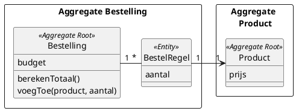

# DEZE OPDRACHT GAAT ERUIT. KOMT TERUG IN WEEK 3 IN ANDERE VORM

# Oefening Aggregate maken

Deze opgave gaat over het reserveren van een beschikbare stoel voor een specifieke vertoning van een film (zoals we dit in les 1 hebben behandeld). Zie de afbeelding hieronder voor de domain story. 


:point_right: Voeg in `jouw_uitwerking/klassendiagram.puml` plantuml-code toe waarmee je aangeeft welke klassen samen de aggregate vormen en welke klasse de aggregate root is.

Houd er echter rekening mee dat dezelfde fysieke stoel gebruikt kan worden in verschillende vertoningen die niet op hetzelfde moment plaatsvinden.

De invariant die bewaakt moet worden is:

```plaintext

Binnen één vertoning kan een stoel maximaal één reservering hebben.

```

Je mag klassen en methodes toevoegen en verplaatsen en verwijderen.

:point_right: Als je veranderingen aanbrengt in het klassendiagram, pas dan ook `jouw_uitwerking/sequentie-diagram.puml` aan zodat klassendiagram en sequentiediagram met elkaar overeen komen.

Zie hieronder voor voorbeeld van hoe je aggregates kunt aangeven in plantuml

