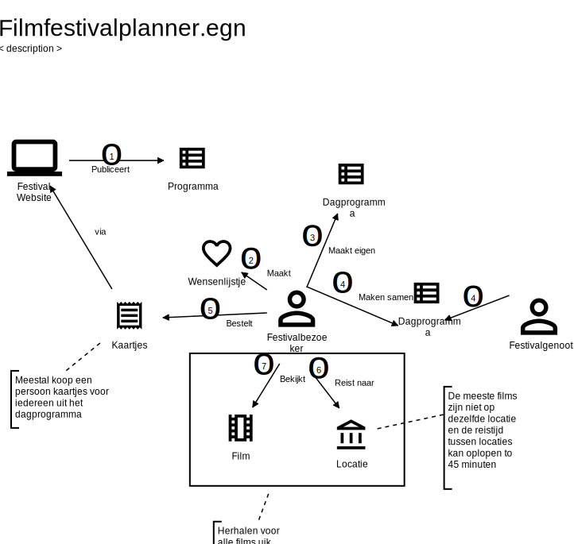

# Festival Planner 

De casus van deze week is een planner voor festivals (of conferenties en andere grotere evenementen) die bezoekers helpt bij het maken van een eigen planning van alle favoriete shows. Om de casus niet te groot te houden, nemen we als voorbeeld een jaarlijks terugkerend filmfestival (bijvoorbeeld IFFR).

## Beschrijving

Het filmfestival vindt jaarlijks plaats gedurende twee weken in een stad. In alle bioscopen uit de stad worden op verschillende momenten verschillende films getoond. Festivalbezoekers kunnen kaartjes kopen voor de films die ze willen zien.

Festivalbezoekers willen vaak meerdere dagen naar het festival en hebben vaak voorkeuren voor de films, of de combinatie van films die ze willen zien. Daarnaast gaan bezoekers vaak samen een, of meerder dagen naar het festival. Deze nieuwe app moet bezoekers daarom helpen bij het plannen van individuele en gezamenlijke festivalbezoeken.       

Hieronder zie je een overzicht van een typisch scenario waarin een festivalbezoeker één dag alleen gaat en een andere dag samen met iemand anders.  

1) Een aantal maanden voor de start van het festival wordt het hele festivalprogramma gepubliceerd op de website. Het programma bestaat uit alle vertoningen van alle films gedurende die uitvoering van het festival. Het programma kan op verschillende manieren bekeken worden, bijvoorbeeld als een blokkenschema. HIERONDER EEN AANTAL PLAATJES

2) De festivalbezoeker bekijkt het programma en maakt een lijstje van de films die de bezoeker graag wil zien.  

3) De bezoeker stelt een mogelijk programma 

4) Twee, of meerdere bezoekers maken samen een programma voor de dag waarop ze samen naar het festival gaan

5) De bezoeker koopt kaartjes voor de films uit de dagprogramma's. Één bezoeker koopt vaak de kaartjes voor alle festivalgenoten op één dag. 

6) De bezoeker reist naar de locatie. 

## Probleemstelling

De nieuwe app moet zich focussen op stap 2, 3 en 4. Meestal gaan stappen niet zo soepel als in dit scenario voorgesteld. 

Meestal gaan stap 2, 3 en 4 niet zo soepel als in dit voorbeeld.  

VERDER UITWERKEN